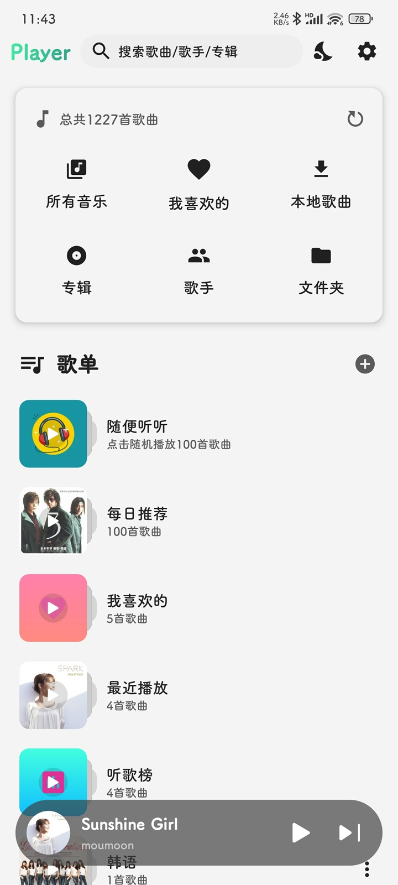
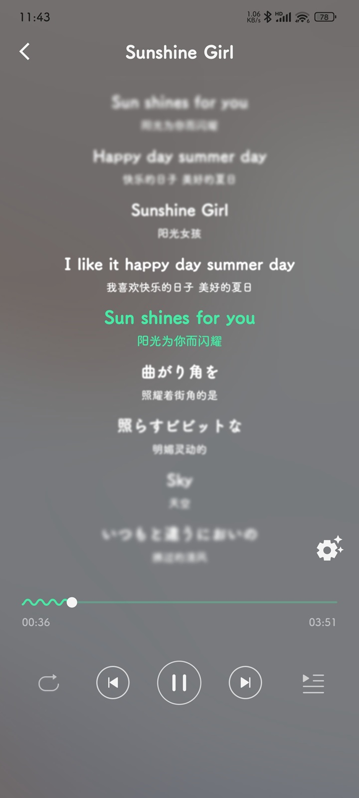
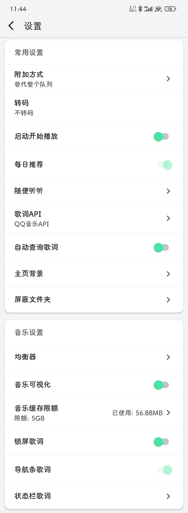

# Player
适配群晖Audio StationAPI自实现播放器APP。利用空闲时间自己开发满足自己使用，独乐乐不如众乐乐，分享出来大家用。由于个人能力有限并且时间不是很充裕，有什么崩溃的请谅解，我会尽力解决和持续优化！

   

 如果在使用中发现问题或有任何建议，可以在 Issues 栏目下新建问题，尽量描述清楚问题出现的步骤，有条件请提供截图。
 
本项目只有安卓版本 [下载地址](https://www.pgyer.com/CL6uvs)

## 已实现功能
- [x] 支持Navidrome服务端
- [x] 支持群晖QuickConnect
- [x] 支持群晖6.x,7.x
- [x] 文件夹视图
- [x] 离线播放
- [x] 歌词搜索
- [x] 歌词样式调整
- [x] 支持播放条歌词
- [x] 倍速播放
- [x] 定时播放
- [x] 收藏（同步群晖5星）
- [x] 夜间/白天模式
- [x] 每日推荐
- [x] 随机推荐播放
- [x] 随便听听可以配置指定文件夹随机
- [x] 全局配置屏蔽指定文件夹
- [x] 最近播放
- [x] app背景修改
- [x] 均衡器
- [x] 音乐可视化
- [x] 锁屏歌词（国产系统可能无效）
- [x] 状态栏歌词
- [x] 自动查询歌词(接入三方qq歌词)
- [x] 歌曲排序
- [x] 启动APP自动播放
- [x] 支持Lyric-Getter
- [ ] 更多功能下载体验吧
## 计划
### 进行中
- [x] 完善适配Navidrome服务
- [x] 修复体验相关问题
## 待定
- [ ] 适配Emby服务
